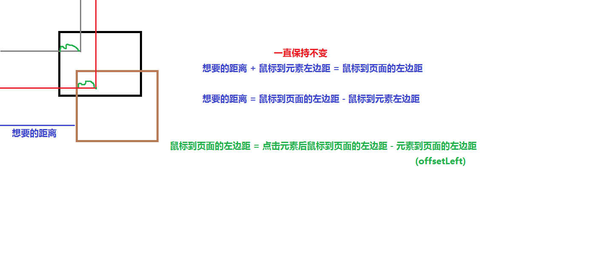

拖拽效果
--------------

#####讲解流程：

1. 

我们今天来做一个拖拽的效果，类似于这样一个效果，打开我的计算机，会出现这样一个弹出框，当我们点到上面这块区域，点住鼠标别松手，然后来移动我们的鼠标，这个框就会跟随我们的鼠标一起移动。这是window给我们提供的功能，我们在网页中也能做一个类似这样的功能。这样的效果，在页面中用的还是比较多的，比如说，打开微博看一下，当我们去转发某条微博时，比如这就这条吧，我们点击转发，看到会弹出一个框，看，我们鼠标放在上面这块区域，鼠标变成了可拖拽的形状，点住鼠标别松开，然后移动我们的鼠标，这个框现在就会跟随我们的鼠标一起移动。随便移动到页面中的任何位置都可以，然后松开鼠标标，这个弹框就停在了这个位置。这样做的好处，可以自由的将这个框移动到空白区域，不至于遮盖到下面的内容。这样的效果在网上很常见，大家再浏览网站时，留心注意下这样的效果。

那我们今天就来做类似这样的一个拖拽效果，当然，我们不做这么复杂，我们只在页面中放一个div，我们拖动这个div移动。先在页面中简单的布局：

	

简单的给点样式，打开浏览器看下，当点到这个div上面，但不抬起鼠标，移动鼠标，让div跟随我们的鼠标移动。

想让div移动，要不断的变换它的left值和top值就可以

那我们怎么算出来鼠标移动后，得到left值和top值呢？

我们打开画图工具分析下这种效果。

画个框代表我们的div，当鼠标点击到div上，移动鼠标，想让div移动到这个位置来，我们先来看left值，那这个距离就是我们想要的距离，我们标记为想要的距离，把这段距离给这个div的left，是不是div就会移动到这个位置上来了。那我们怎么算出这段我们想要的距离呢？当div移动这个位置时，我们是能获取鼠标到浏览器左边距离的，也就是这条红色线的距离，我们再注意观察一下，我们把鼠标到元素左边的距离标为绿色，那这段距离加上我们想要的距离，是不是正好等与鼠标到浏览器左边的位置？也就是：

>想要的距离 + 鼠标到元素左边的距离 = 鼠标到页面的左边距

那我们要计算出我们想要距离，是不是就是这样：

>想要的距离 = 鼠标到页面的左边距 - 鼠标到元素左边的距离

在鼠标移动过程中鼠标到页面的左边距是能够获得的，只要我们能够获取到鼠标到元素左边的距离是不是就可以算出我们想要到的距离，对吧？

我们再打开我的计算机看下，当点击上面这个区域的时候，拖住这个框再怎么移动，你鼠标的位置到这个框左边的距离永远没有变化，对吧？打开我们的画图工具，看下我们画的这个图。

我们来看这个黑框，这是我们移动前的状态，当鼠标点击到这个位置，画绿色这段距离就是我们的鼠标到元素左边的距离，这段距离跟我们移动到这个位置后的这段绿色距离，是不是一直保持不变。也就是说：

>当鼠标点击在div上后，鼠标到div左边的距离，在移动的过程中是一直保持不变的

那这段距离怎么得到呢？我们注意看下，当鼠标点击到这个元素那一刹间，我们能获取到鼠标到浏览器左边距的距离，我们是不是可以通过offsetLeft获取到元素到浏览器左边的这段距离，也就是说：

>鼠标到元素左边的距离 = 鼠标到页面的左边距 - 元素到页面的左边距(offsetLeft);

鼠标到页面的左边距我们能够获取到，元素到页面的左边距也能获取到，那是不是就能求出鼠标到元素左边的距离了？有了这个值，我们就能求出我们想要的距离，然后把这个想要的距离赋给元素的left，那这个元素就会移动这个位置来。

此时我们只是建立在理论基础上，那我们用代码来实现下这个效果。

